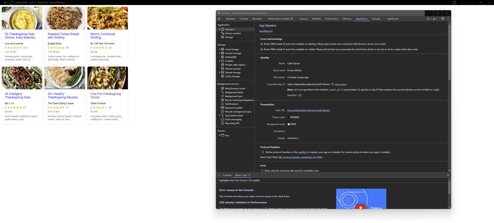

# Lab8-Starter

Pranav Mehta

https://daphysikist.github.io/Lab8-Starter/

Graceful degradation involves making an app functional even when components such as the Javascript or network connectivity are unavailable. Service workers specifically address the loss of network connectivity by keeping a local cache of fetched data from the internet so that users can access data they have already accessed before even when network connectivity is down, allowing for graceful degradation of the data in that regard, since the app is now still functional even without internet.

